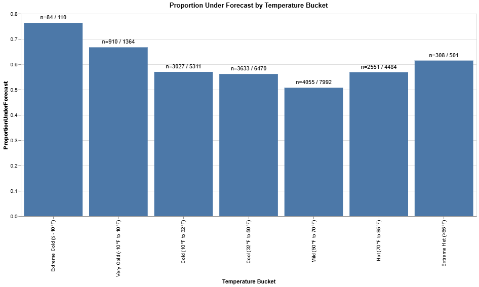
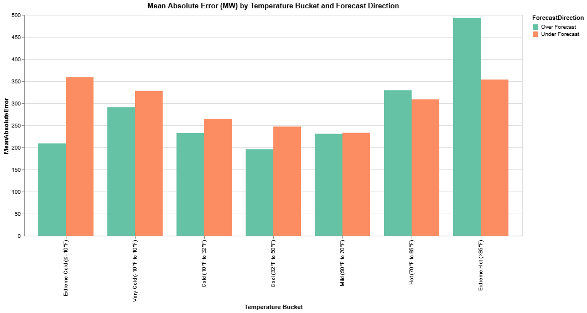

# MISO LRZ1 Load Forecast Error Analysis: A Risk-Based Approach

**Location**: Minnesota (LRZ1)
**Analysis Time Frame**: January 2023 - January 2026
**Data Sources**: MISO RTDIP, KMSP Weather Station

---

## Executive Summary

MISO's load forecasts for Minnesota (LRZ1) show large directional bias patterns which can create asymmetric financial risk for local utilities.
During extreme cold events (< -10°F) MISO has under-forecasted in 76% of hourly cases. 
Under-forecasted events in extreme cold carry a mean absolute error of 359 MW which can expose utitlities to scarcity pricing risk when real-time prices are much higher than the day-ahead market. 
However, it is not as straightforward as adjusting the MISO forecasts upward to account for bias. Analysis of January 2024 reveals instances of scarcity pricing
and false-scarcity pricing in which real-time prices were significantly lower than the day-ahead market.

**Key Finding**: Load forecasting error costs are **regime-dependent**, not directional. 
During **true scarcity** (RT > DA), under-forecasting creates 10x or greater cost asymmetry via scarcity pricing. 
During  **"false scarcity"**  —as seen Jan 16-17, 2024 (DA $165/MWh, RT $44/MWh) (FERC 561/RUS 580, non-recoverable). 
The correct hedge depends on the **scarcity regime prediction**, not blanket directional bias.

*Note: Detailed scarcity pricing analysis will be conducted in Phase 2 using MISO settlement data.*

---

## Phase 1: When and Where Do Forecast Errors Occur?

### Directional Error Analysis by Temperature Bucket

*Key Insight: Extreme cold events show systematic under-forecast bias (76% of errors), while extreme heat reveals model uncertainty with 493 MW over-forecast magnitude. Both patterns create asymmetric cost exposure that standard MAPE does not convey.*

- **Extreme Cold (< -10°F)**: 76% under-forecast errors, under-forecast mean error of 359 MW.
- **Extreme Heat (> 85°F)**: 61% under-forecast errors, under-forecast mean error of 354 MW and over-forecast mean error of 493 MW.
- **Cold to Mild (10°F - 70°F)**: 50-57% under-forecast errors, mean error ranges from 195 - 264 MW.

## Phase 2: Directional Error Asymmetry (Work in progress)

- `acquire_miso_fuel_mix.py` - Fuel mix pipeline
- `acquire_miso_prices.py` - Day-ahead/real-time pricing
- `analysis_cost_asymmetry.py` - Regime identification and dollarize error costs

### Phase 2 Methodology (plan)

**Scarcity Regime Identification**: Rule-based classifier using:
- Day-ahead price level
- RT-DA spread magnitude and direction 
- Temperature forecast confidence intervals
- Gas pipeline capacity constraints

